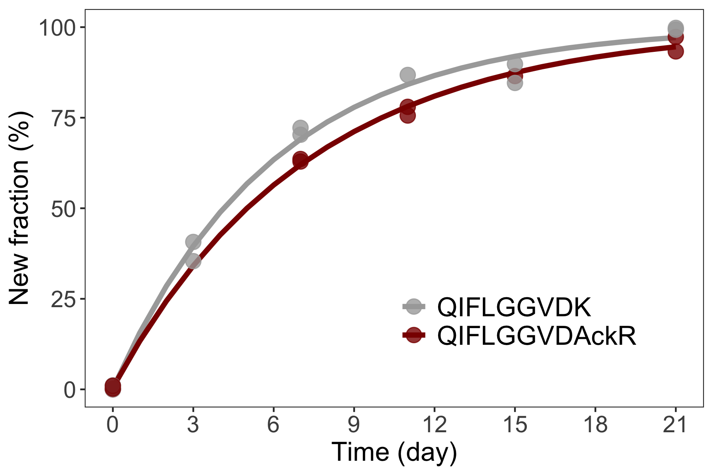
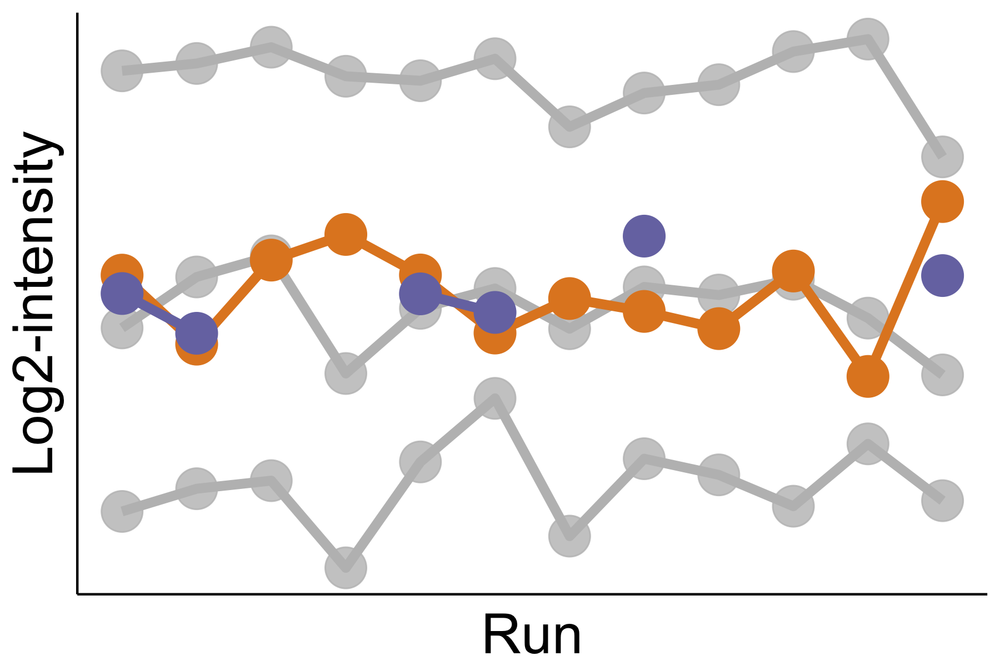
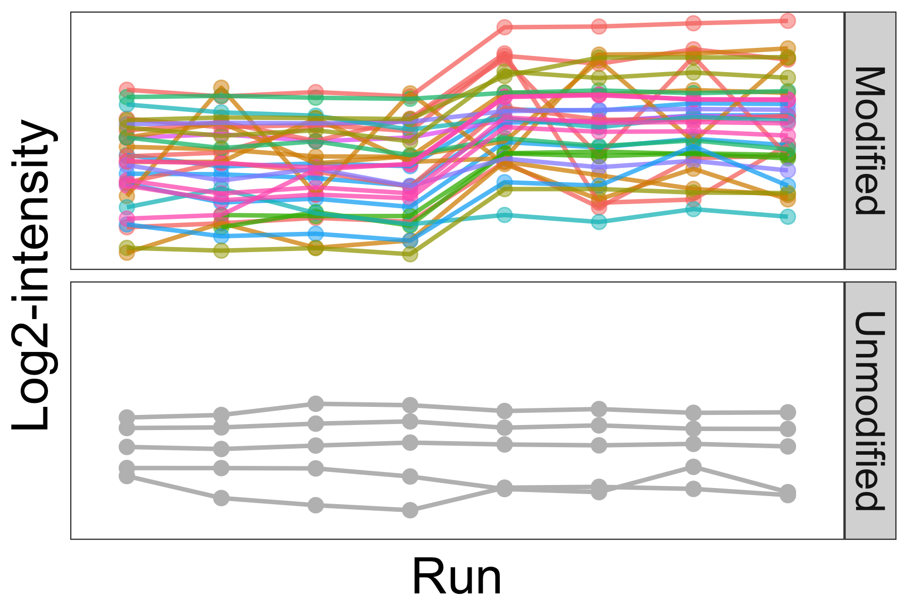
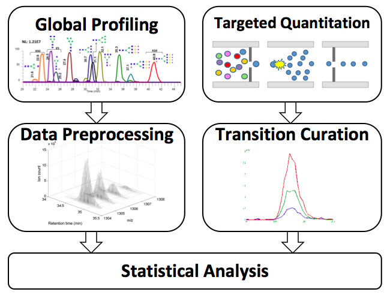
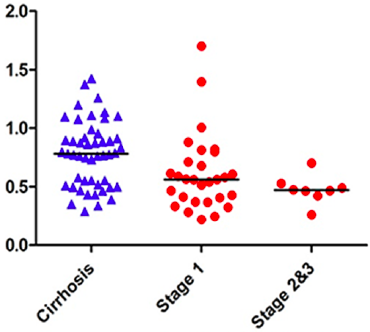

My research concerns statistical problems in computational biology and bioinformatics. I use statistical modeling to develop expressive, effective and extendable approaches in interdisciplinary research, leading to rigorous and reproducible analyses. 

### Statistical mass spectrometry-based proteomics

Open-source software facilitates the transparency and reproducibility in scientific research. I was a key developer of MSstats, an open-source R/Bioconductor package for statistical relative quantification of proteins in MS-based proteomics. MSstats provides a general and flexible statistical framework, which offers both flexibility for diverse data acquisition workflows and consistency of data analysis across workflows. My most recent contributions to quantitative proteomics include the development of a feature selection approach for relative protein quantification, statistical methods and tools for quantitative characterization of post-translational modifications, and kinetic models for analyses of protein dynamics.

---

#### Statistical inference of protein turnover

Beyond quantitative analysis of protein abundance, PTMs and structures in steady state, the dynamic behavior of protein is characterized by protein turnover, the balance of protein synthesis and degradation. With LC-MS/MS, protein turnover can be analyzed using stable isotope labeling, where the protein kinetic is measured through the incorporation of isotopes into protein over time and the resulting time series is typically described by differential equations. We have developed a statistical approach that uses nonlinear regression to jointly model all time-series data pertaining to a protein. The joint modeling approach gives efficient estimation of turnover and improves the accuracy and sensitivity in detecting changes in turnover over conventional methods. 

[Manuscript](https://pubmed.ncbi.nlm.nih.gov/37224468/)

---

#### Selection of informative features for relative protein quantification

Summaries of protein abundance are undermined by mass spectrometric features inconsistent with the overall protein profile. We develop an automated statistical approach that detects such inconsistent features. These features can be separately investigated, curated, or removed. Accounting for such inconsistent features improves the estimation and the detection of differential protein abundance between conditions. The approach is implemented as an option in the open-source R-based software MSstats. 

[Manuscript](https://www.ncbi.nlm.nih.gov/pubmed/32234965), [Supplemental](https://github.com/tsunghengtsai/MSstats-feature-selection)

---

#### Statistical characterization of post-translational modifications

Interpretation of changes at a single PTM site in a typical bottom-up proteomics workflow is complicated by sparse PTM coverage and confounded by both changes in overall protein abundance and variability in enrichment efficiency. We propose an alternative statistical approach to model relative abundance changes for modification sites, which explicitly incorporates major sources of variability and confounding factors present in PTM experiments. The general statistical framework underlying the proposed approach also allows for natural extensions to complex experimental designs including multiple conditions and multiple batches. All algorithms and statistical tests are implemented in the MSstatsPTM R package.

[Manuscript](https://www.ncbi.nlm.nih.gov/pubmed/36496144)

---

#### Statistical characterization of therapeutic protein modifications

This study addresses three primary goals of therapeutic protein characterization: (1) the objective estimation of site occupancyin a particularcondition, (2) the determination of systematic changes in site occupancies (i.e., differential site occupancy) between conditions, and (3) the estimation of combined occupancy over multiple sites. We demonstrated the importance of appropriate statistical modeling, for reproducible, accurate and efficient site occupancy estimation and differential analysis. 

[Manuscript](https://www.ncbi.nlm.nih.gov/pubmed/28801661)

---

### Bioinformatics for high-throughput omics 

The development of high-throughput omics technologies has necessitated an increased reliance on computational methods and tools to extract knowledge from the vast amount of data. I made several original contributions to the development of computational and statistical methods for the analysis of mass spectrometry (MS) and gene expression microarray data. These methods enable robust and reproducible analyses by properly characterizing the variation in the raw measurements and/or deconvoluting quantitative information from multiple sources. 

---

#### Bayesian alignment model for analysis of LC-MS based omic data

Retention time alignment is crucial for the analysis of LC-MS based omic data. The proposed Bayesian alignment model provides estimates of the retention time variability along with uncertainty measures, enabling integration of multiple sources of information including internal standards and clustered chromatograms. This model has been successfully applied to data from LC-MS proteomic, metabolomic and glycomic studies. 

[Manuscript](https://www.ncbi.nlm.nih.gov/pubmed/24013927), [Supplemental](https://github.com/tsunghengtsai/alignLCMS)

---

#### Profile-based LC-MS data alignment 

This study provides methodological foundation for the Bayesian alignment model and demonstrates a proof of concept for profile-based data alignment. The proposed model uses Markov chain Monte Carlo (MCMC) methods to draw inference on model parameters and improves on existing MCMC based alignment methods through 1) the implementation of an efficient MCMC sampler and 2) an adaptive selection of knots using stochastic search variable selection (SSVS). 

[Manuscript](https://www.ncbi.nlm.nih.gov/pubmed/23929872)

---

### Biomarker discovery 

Early detection of hepatocellular carcinoma (HCC) is crucial for the treatment of the disease, as rates of survival increase immensely in proportion to how early the diagnosis is made. I led or played a major role in three large-scale omics analyses (proteomics, metabolomics and glycomics) of hundreds of serum samples collected from subjects in Egyptian and US populations. These analyses have led to the identification of numerous biomolecules altered significantly in HCC cases vs. patients with liver cirrhosis.

---

#### LC-MS based serum glycomics for HCC biomarker discovery

Hepatocellular carcinoma (HCC) is the third leading cause of cancer mortality worldwide with five-year survival rate less than 15%. Glycosylation has important implications in the development and progression of cancer. In collaboration with analytical chemists at TTU, we used two complementary LC-MS methods, global profiling and targeted quantitation, to analyze serum N-glycans from hundreds of participants recruited in Egypt and the US, and identified candidate biomarkers that distinguishing HCC cases from patients with liver cirrhosis. In this study, I led the effort on quantitative analysis including development of preprocessing pipelines and statistical analysis. 

[Manuscript](https://www.ncbi.nlm.nih.gov/pubmed/25077556)

---

#### LC-MS based serum proteomics for HCC biomarker discovery

In this proteomic study, I led the effort on study design and data analysis including initial assessment of different analytical protocols and platforms. We identified candidate protein biomarkers through LC-MS/MS based untargeted analysis of sera. These proteins were further evaluated by targeted quantitation using MRM. Our findings independently confirmed several previously reported HCC protein biomarkers and revealed a number of new candidate biomarkers. Among these, there were 21 candidate protein biomarkers found significant in our two study cohorts in Egypt and the US. Furthermore, through multivariate analysis we identified a panel of six protein biomarkers, which yielded better performance than alpha-fetoprotein (AFP), the HCC biomarker in current use. 

[Manuscript](https://www.ncbi.nlm.nih.gov/pubmed/25778709)

---

#### LC-MS based serum metabolomics for HCC biomarker discovery

I contributed to the analysis of LC-MS metabolomic data for HCC biomarker discovery through development of outlier screening method using the Stahel-Donoho robust estimator and application of XCMS preprocessing pipelines. As in our glycomic and proteomic studies, the metabolomic analysis was performed on two study cohorts in Egypt and the US. The three types of omic measurements conducted on the same subjects present an interesting yet challenging opportunity to integrate multi-omic signatures for a more comprehensive characterization of HCC. 

[Manuscript 1](https://www.ncbi.nlm.nih.gov/pubmed/22882828), [Manuscript 2](https://www.ncbi.nlm.nih.gov/pubmed/23078175)

---

#### Spike-in experiment for evaluation of preprocessing pipelines

Prior to our HCC biomarker discovery studies, we conducted critical assessment on existing preprocessing pipelines for LC-MS data analysis. We simulated a simple model with "presence" and "absence" condition using spike-in experiments, and evaluated tools on the basis of their capabilities to identify the true differences. This study highlights critical preprocessing steps and helps prioritize improvement on relevant analytical and computational approaches, which has greatly facilitated our subsequent omic studies for biomarker discovery. 

[Manuscript](https://www.ncbi.nlm.nih.gov/pubmed/22369182)

